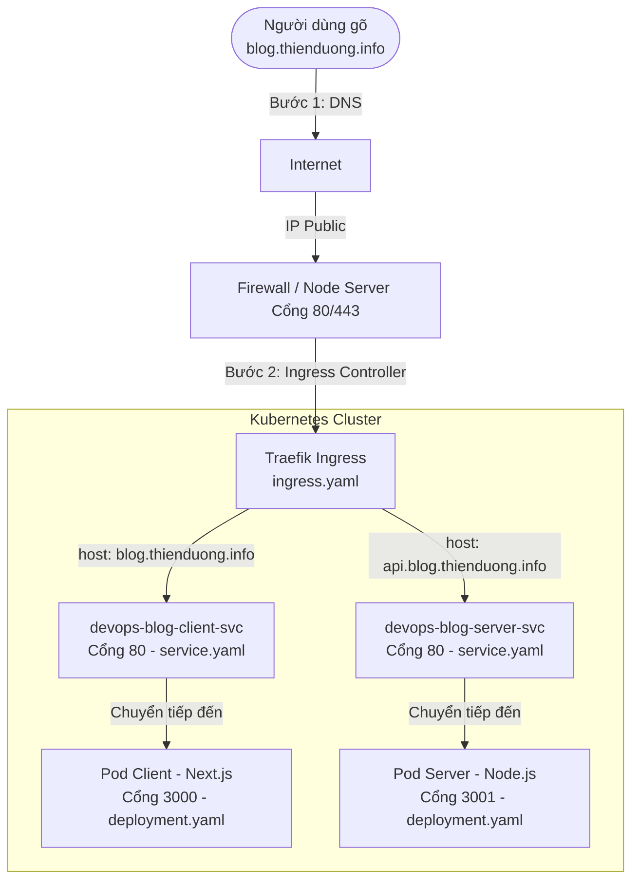

# Kiến Trúc K8s/K3s và Luồng Xử Lý Truy Cập (Traffic Flow)

Tài liệu này giải thích chi tiết cách hệ thống Kubernetes (K3s) nhận các yêu cầu truy cập từ người dùng thông qua tên miền, và làm thế nào các request đó được định tuyến (routing) đi sâu vào đến tận ứng dụng Next.js (Client) và Node.js (Server).

---

## 1. Hành trình của một Request: Từ tên miền đến Ứng dụng

Luồng kết nối sẽ diễn ra tuần tự qua các lớp như sau: 

### Bước 1: Phân giải tên miền (DNS)
- Người dùng gõ `https://blog.thienduong.info` trên Trình duyệt.
- Tên miền này được Server DNS phân giải và trỏ về (Record A) **IP Public** của máy chủ cài đặt K3s. 

### Bước 2: Đi qua Cửa ngõ (Ingress Controller)
- Máy chủ K3s mở sẵn 2 cổng `80` (HTTP) và `443` (HTTPS) trên server thực tế, được quản lý bởi **Traefik** (một dạng Ingress Controller).
- Khi request đến nền tảng, Traefik sẽ xem thông tin (Header Host) gửi lên là gì (`blog` hay `api`).
- Dựa vào tờ "bản đồ" mang tên **`ingress.yaml`**, Traefik nhận diện đường đi:
    - Nếu đến từ `blog.thienduong.info`, định tuyến tới Service tên là `devops-blog-client-svc`.
    - Nếu đến từ `api.blog.thienduong.info`, định tuyến tới Service tên là `devops-blog-server-svc`.
- *(Traefik cũng phụ trách việc cấu hình tự động ép HTTPS cho các request HTTP - thực hiện qua file `traefik-redirect.yaml` và xuất chứng chỉ bảo mật cho domain).*

### Bước 3: Định vị ứng dụng qua Service
- **Service** (khởi tạo từ `service.yaml`) không phải là ứng dụng thật. Nó đóng vai trò như "Trạm chuyển tiếp" (Load Balancer nội bộ / cấp phát IP tĩnh cho ứng dụng).
- Các ứng dụng (Pod) luôn bị huỷ hoặc được tạo lại (thay đổi IP nội bộ) khi có phiên bản cập nhật hoặc lỗi, nhưng IP nội bộ của Service thì luôn vững chắc không đổi.
- Khi traffic từ ngoài đi qua Ingress tràn vào Service (`devops-blog-client-svc`), Service lập tức tìm những Pod (chạy Next.js) đang làm việc ổn định để chuyển request vào cho chúng (Ở ví dụ code là cổng **3000** - Tàu chứa Next.js).

### Bước 4: Ứng dụng xử lý gốc (Deployment / Pod)
- Ứng dụng gốc (`devops-blog-client`) được cấu hình từ **`deployment.yaml`** sẽ nhận các luồng truy xuất ở tận cùng. Tại đây ứng dụng nhận thông tin thực tế, biên dịch mã NodeJS thành render ra nội dung HTML.
- Nội dung trả về sẽ đi ngược dòng về qua Service => Ingress => Trả kết quả hiển thị trên trình duyệt của Người dùng.

---

## 2. Ý Nghĩa Thực Tế Của Từng Nhóm File Cấu Hình K8s

Trong thư mục `k8s/`, hệ thống file được tách biệt theo các cấp độ vận hành như sau:

### 🌟 Nhóm cốt lõi chạy Ứng dụng (Core Application Services)
1. **`deployment.yaml` (Nhà máy sản xuất app)**
   - **Mục đích**: Là công cụ duy trì sự sống thực tế của ứng dụng.
   - **Hoạt động**: Thay vì chạy bằng lệnh `npm run start` tay không, Deployment khởi động các Container Image đã build. Nó có cơ chế `RollingUpdate` (Zero-downtime) đảm bảo khi deploy mã mới, k8s sẽ dựng app mới và chạy thử bài kiểm tra sức khoẻ (Readiness) thành công thì mới cho phép app version cũ biến mất. Nó cũng giới hạn ứng dụng chỉ được phép mở biên độ ăn RAM/CPU tối đa bao nhiêu.

2. **`service.yaml` (Ngã tư chuyển hàng)**
   - **Mục đích**: Gán vị trí định danh và cân bằng tải.
   - **Hoạt động**: Group 1 hoặc vô số bản sao của 1 ứng dụng vào chung 1 tên miền `devops-blog-client-svc` ảo nội bộ. Cả phía Ingress lẫn phía code muốn trỏ Server API chỉ cần điền đúng vào tên Service là hệ thống tự tìm được nhau.

3. **`ingress.yaml` (Lễ tân chỉ đường)**
   - **Mục đích**: Bộ nhận diện tên miệng từ Internet và điều phối vào Service.
   - **Hoạt động**: Lắng nghe mọi request, có Rule so khớp tên miền nào với Service nào.

4. **`secret.yaml` (Hộp giữ tiền)**
   - **Mục đích**: Lưu trữ thông tin cài đặt nhạy cảm.
   - **Hoạt động**: Mọi Database Connection String, Token JWT Auth, hay mật khẩu Gmail gửi thư sẽ đều được mã hoá Base64 cất trong này. Nó sẽ bơm ẩn dưới dạng Environment Variable cho Server Pod để tăng cường an toàn, hoàn toàn thay thế khái niệm `.env` trong bảo mật DevOps thông thường.

### 🛡 Nhóm Infrastructure & Tối ưu hoá mạng lưới
1. **`k3s-config.yaml`**
   - Cấu hình gốc thiếp lập khi setup cụm k3s server ban đầu.

2. **`traefik-redirect.yaml`**
   - Thay đổi cài đặt bên trong Traefik. Bóp chết và redirect hoàn toàn mọi traffic HTTP gửi lậu thành HTTPS để chặn rủi ro nghe lén mạng; và thiết lập bật Log truy cập (IP, Thiết bị...) để máy gom Log bắt được luồng thông tin vào server.

### 📊 Nhóm Hệ thống Logging & Monitoring tĩnh học
Bộ công cụ phía sau giúp đảm bảo ứng dụng luôn chạy, lưu lại biểu đồ cho admin mà không cần chui vào Server gõ lệnh thủ công rườm rà.

1. **Sinh trắc đồ hệ thống (`prometheus-values.yaml`, `server-podmonitor.yaml`, `alert-rules.yaml`)**
   - Nó đóng vai trò "cặp nhiệt kế": Cào cấu ra trạng thái từng thành phần linh kiện máy móc, đo nhiệt độ RAM có bị nghẽn không, đo nhịp tim số lỗi Internal Server Error trả về.
   - Gắn Alert: Nếu ứng dụng bị "đột quỵ" tự động sinh email báo động hoặc bot slack ném tin nhắn triệu hồi kĩ sư.
   
2. **Loa phát báo lỗi (`promtail-values.yaml`, `loki-values.yaml`, `loki3-values.yaml`)**
   - Thiết lập xe gom rác `Promtail` bắt và hút tất cả log từ console.log trong các pod một cách âm thầm, bơm về "hố rác tổng" là cục `Loki`. Giúp Developer đọc lại lỗi lịch sử ứng dụng từ giao diện web siêu chi tiết.
